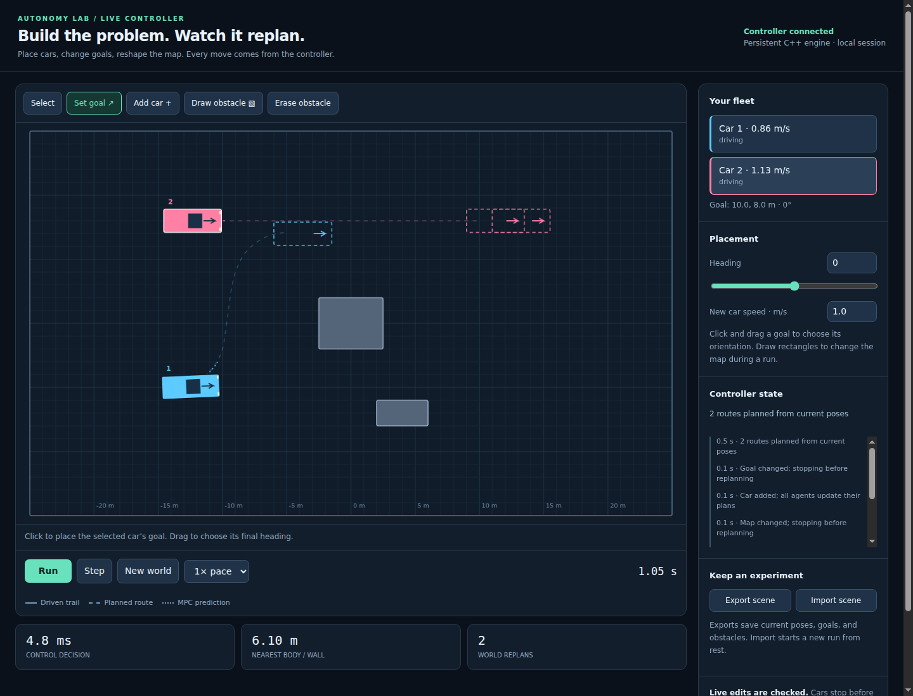
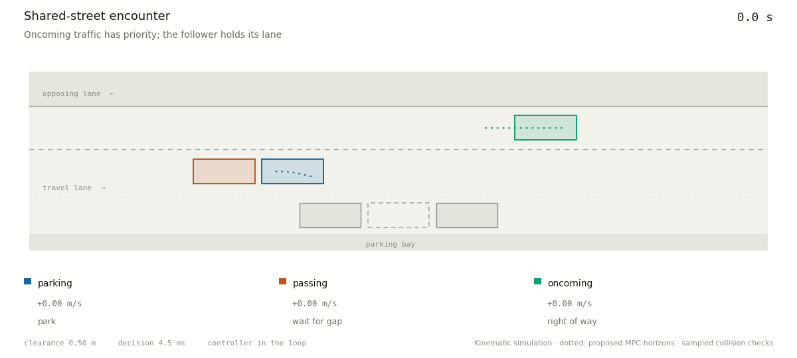

# Autonomy Lab / MPC Parking

A live, editable multi-car autonomy sandbox backed by a dependency-free C++17
planner and controller. Place cars, change their goals, and draw obstacles while
the simulation runs. Hybrid A* finds routes from the measured poses; independent
constrained iLQR controllers track those routes while exchanging predicted motion.

## Start the live lab

```sh
python3 tools/serve_lab.py
# Open http://127.0.0.1:8080
```

The launcher builds `//:live_worker` with Buck2 and starts a local HTTP server.
The server owns one persistent C++ world. Python's standard library is sufficient;
there are no web packages or frontend build steps. If Buck2 is elsewhere, pass
`--buck2 /path/to/buck2`. Use `--port 8081` if port 8080 is occupied.



- **Run / Step:** advance the native controller and vehicle model.
- **Set goal:** select a car, then click and drag a destination and final heading.
- **Add car:** place another vehicle anywhere its footprint and stopping path fit.
- **Draw / erase obstacle:** change the map and watch routes update.
- **Export / import:** save current poses, goals, and geometry as an editable JSON scene.

Cars have no fixed parking, passing, or oncoming roles in the live world. It
supports 1–8 cars and up to 40 rectangular obstacles on a 50 × 30 m map.
Goal/map edits preserve each car's measured pose and velocity. The fleet brakes,
then replans from rest. New geometry is checked against the entire nominal
stopping rollout before acceptance; rejected edits leave the world unchanged.
The UI shows driven trails, geometric routes, proposed MPC horizons, and the
controller's actual status. Simulation time pauses during planning and computation;
playback pace is a target, not a real-time execution guarantee.

Each accepted joint command must also leave a collision-free nominal braking
rollout from its predicted endpoint. This gives the deadline fallback a checked
stopping path under the same vehicle model. Those checks still sample motion at
15 ms intervals and assume all agents apply the joint controls; they do not
establish safety under model error, uncooperative drivers, or missed collisions
between samples.

Peer footprints inform geometric planning and their shared predictions enter
every local MPC solve. If progress stalls, the engine makes up to three recovery
planning attempts. `NO_ROUTE`, `BLOCKED`, and `SAFETY_STOP` are explicit failures
or waiting states, not completed goals. General multi-car deadlock resolution
and guaranteed goal reachability remain open. The scene-specific right-of-way
protocol below is not used by this live controller.

`//:world_tests` exercises a map edit while moving, adding a second car, changing
a completed goal, crossing goals, atomic rejection of an unsafe edit, and an
unreachable goal. Functional tests use a generous solve budget under sanitizers;
a separate expired-budget test checks braking fallback. The browser editor has also been exercised against the native
worker, including goal dragging, obstacle drawing, live stepping, and mobile layout.

The server binds to localhost and shares one world across its browser tabs.
Keep it local. Closing the launcher terminates its native worker. Importing a
scene starts a new simulation from rest; it does not replay saved velocities.

## Original parking and traffic experiments

Three built-in scenes exercise parallel parking, perpendicular parking, and a
narrow garage. The vehicle supports forward/reverse motion, steering-rate and
acceleration limits, exact footprint collision checks, and differentiable
obstacle constraints based on covering circles.

The negotiated traffic experiment includes **three interacting vehicles**: a car
parallel-parking, a follower passing through the opposing lane, and a car
approaching in that lane. Open the [interactive replay](artifacts/traffic_replay.html)
in a browser to scrub through the encounter, jump between negotiation events,
and inspect each controller's proposed horizon, speed, and steering.



## Parking with oncoming traffic

```sh
buck2 run //:traffic_encounter -- --output artifacts/traffic_encounter.json
python3 tools/render_traffic.py artifacts/traffic_encounter.json \
  --html artifacts/traffic_replay.html --gif artifacts/traffic_encounter.gif
python3 tools/benchmark_traffic.py
```

The follower requests a pass and remains stopped in its own lane. Before the
parking reference changes to reverse, the parking car brakes and publishes its
stopping trajectory. Passing permission requires both a stopped parking car and
the oncoming car's rear bumper to be at least one metre behind the follower's
rear bumper. The follower then tracks a curvature-checked lane-change path
through the opposing lane. When its rear bumper is 1.5 m beyond the parking
car's front extent, the parking car resumes. Permission stays latched to avoid
oscillating between yield and go. Return completion requires the follower's
whole footprint to be back below the centreline with its heading aligned.

This adds a shared right-of-way supervisor above the independent Jacobi iLQR
solves. Moving agents optimize against every other agent's broadcast prediction;
held agents publish bounded braking trajectories. The simulator runs those local
optimizers as concurrent threads in one process. The supervisor is shared, not
a network consensus implementation. The passing path selects which side of the
parking car to use; iLQR closes the loop from measured states.

The checked-in [six-case report](artifacts/traffic_benchmark.json) covers early
and late oncoming arrivals, faster and slower followers, and discarded controller
results during the pass. Every case must finish all three goals, actually occupy
the opposing lane, restore the travel lane, exercise parking yield, and have no
detected collision, pre-grant lane entry, or measured deadline miss. The default
run waits 16.8 s, holds the parking car for 17.85 s, and completes in 60 s.

Change the traffic without changing the control logic:

```sh
buck2 run //:traffic_encounter -- --oncoming-x 22 --oncoming-speed 1.2 \
  --passing-speed 1.6 --output artifacts/late_traffic.json
buck2 run //:traffic_encounter -- --fault-step 140 \
  --output artifacts/interrupted_traffic.json
```

The JSON includes scene geometry, references, per-tick measured states, modes,
proposed horizons, and outcome metrics. The replay is self-contained and works
offline, with play/pause, speed selection, a time slider, and event buttons.
GIFs use the same measured run. Predictions are proposals, not promises about
future motion. No trajectory is prerecorded into the controller.

This protocol is intentionally conservative for this road and one oncoming car:
it waits for the car to pass completely rather than judging a gap in a stream of
traffic. Roles, lane geometry, and the passing route are specific to this scene.
It assumes perfect, synchronous state/intent sharing and cooperative drivers;
new arrivals, perception uncertainty, and network delays are not modeled. A run
has a 105 s simulation limit and can fail to finish with very slow traffic.
The sampled checking and soft-deadline limits below still apply.

## Build and run

Requires Linux, GCC with C++17 support, Python 3, and Buck2. Validated with
GCC 11.4 on ARM64 and the Buck2 `2026-08-01` binary (bundled prelude).
The Buck targets use `-O2`, explicit exported headers, and pthread linkage.

```sh
buck2 build //:mpc_parking
buck2 test //...
buck2 run //:mpc_parking -- parallel --csv parallel.csv
```

Run the controller in a receding-horizon simulation and render its driven
trajectory as a GIF:

```sh
buck2 run //:mpc_simulator -- parallel simulation.csv
python3 tools/render_gif.py --scenario parallel \
  --trajectory simulation.csv --output parking.gif
```

GIF rendering requires Python 3, Matplotlib, and Pillow. An example closed-loop
run is included at [artifacts/parallel_parking.gif](artifacts/parallel_parking.gif).

## Distributed multi-agent iLQR

The passing experiment runs two independent MPC agents. A lead vehicle slows,
turns, and reverses into a parallel-parking slot while a faster vehicle
approaches from behind. The parking agent publishes its predicted manoeuvre;
the following agent optimizes around it and crosses into the opposing lane to
pass. Different safety margins preserve clearance without making the parking
slot artificially infeasible.

```sh
buck2 run //:distributed_ilqr -- artifacts/distributed_ilqr.csv
python3 tools/render_multi_agent_gif.py \
  --trajectory artifacts/distributed_ilqr.csv \
  --output artifacts/distributed_ilqr.gif
```

Run deterministic timing and safety stress cases with:

```sh
buck2 run //:distributed_stress
```

The benchmark includes seven named cases and six seeded variations of follower
speed, start distance, width, and plant wheelbase. One case discards three
successive controller results to exercise braking and recovery. It writes a
machine-readable report and returns nonzero for incomplete maneuvers, collisions,
or deadline misses; failed cases are retained in the report.

```sh
buck2 run //:distributed_stress -- --seed 20260920 --random-cases 6 \
  --output artifacts/benchmark.json
python3 tools/plot_benchmark.py artifacts/benchmark.json
buck2 test //... -c mpcpark.sanitizers=true
```

See the [benchmark figure](artifacts/benchmark.png) and
[full report](artifacts/benchmark.json). Timing depends on host load; the seed
reproduces scenario parameters, not wall-clock scheduling.

## Controller and safety checks

Each agent solves concurrently against the previous exchange's predictions
(Jacobi iteration), then publishes its new trajectory. Additional exchanges
reuse the preceding solution and stop when the largest predicted state change
falls below 0.03 or the solve budget expires. States have mixed units, so this
threshold is an engineering heuristic, not a convergence certificate.

Before applying a command, actuator bounds are enforced and both vehicles are
rolled out together at ten substeps per control tick. This checks their body
rectangles against each other and every static obstacle, including the terminal
state. The simulated plant also advances at those substeps. Clearance is exact
at each sampled pose; collisions between samples remain possible.

A missing, expired, nonfinite, or rejected result selects bounded braking while
holding steering. Braking is itself checked before application. If neither
command passes, the experiment ends with `safety_stop=true`, `success=false` at
the last measured state. This is an explicit failure to find a safe command,
not a claim that a moving physical vehicle can freeze in place. The check covers
the next control interval, not the entire stopping distance. Fallback pauses
the parking reference and resets its control warm start.

Solvers cooperatively check a common deadline between iterations and line-search
trials, reserving 10% of the 150 ms decision budget for supervision. The report
distinguishes solver timeouts from decisions exceeding 150 ms. A full derivative
pass, thread scheduling, or operating-system delay can overrun the budget;
this is not hard real-time enforcement. Simulation time does not advance while
the host computes. Model mismatch changes only the plant; the controller and
supervisor retain the nominal vehicle model.

The multi-agent experiments declare completion at 20 cm position error,
0.08 rad heading error, and 0.08 m/s speed for both cars. These are looser than
the original single-car parking tolerances. The original two-car demo assumes
an empty opposing lane; `//:traffic_encounter` adds the oncoming vehicle and the
right-of-way protocol described above. Neither includes a sensor model or an
external driving simulator.

`buck2 test //...` covers numerical derivatives, geometric planning, moving
obstacle stages, mid-tick and terminal collisions, malformed inputs, braking in
both directions, expired deadlines, injected missing results, negotiation
transitions, bumper-based release conditions, and the complete three-car
interaction. The functional encounter test uses a generous solve deadline for
sanitizer runs; the benchmark measures the normal 150 ms budget. The longer
closed-loop suite is `//:distributed_stress`. Sanitizers run the test targets;
timing benchmarks should use the normal optimized build.

Use `perpendicular` or `garage` for the other scenes. `--plan-only` runs just
Hybrid A*, which is useful when tuning the search. CSV output contains the
state and control at every time step.

The executable prints planner timing and expansions, solver timing and
constraint violation, final goal error, collision status, and whether the
trajectory meets the parking tolerances.
